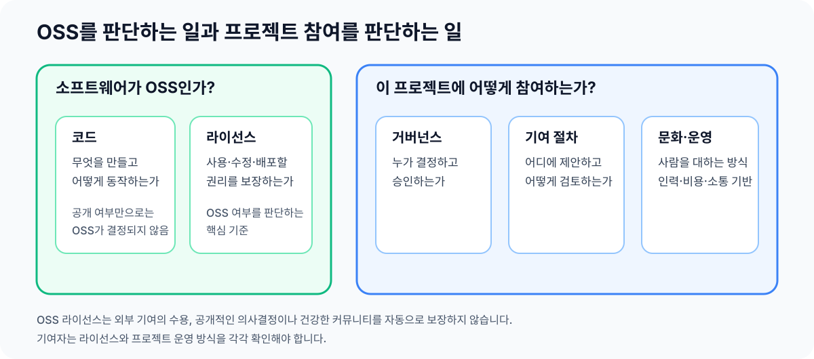

> 아직 작성 중입니다.

# 3장. 프로젝트의 운영 구조

OSS라는 분류는 소프트웨어를 사용할 권리에 관한 것이지, 외부인이 개발에 참여할 권리를 보장하는 것이 아닙니다. 실제 참여 가능성은 누가 어떤 권한을 가지고, 어디에서 논의하며, 어떻게 결정하는지에 따라 달라집니다.

<figure>
  
  <figcaption>소프트웨어의 이용 권리와 프로젝트의 참여 방식은 서로 다른 정보로 판단합니다.</figcaption>
</figure>

이 장은 프로젝트의 운영 구조를 판단하는 최소 모형만 제공합니다. 개별 역할의 정확한 권한과 의사결정 절차는 해당 프로젝트의 거버넌스 문서에서 확인해야 합니다.

## 참여자 역할

프로젝트에는 서로 다른 책임을 맡은 사람들이 참여합니다.

- **사용자**는 프로젝트를 사용하고, 문제를 알리거나 다른 사용자를 돕습니다.
- **기여자**는 코드, 문서, 테스트, 디자인과 문제 분석 등을 제안합니다.
- **커미터·메인테이너**는 변경을 검토·병합하고 저장소, Issue, 릴리스를 지속적으로 관리합니다.
- **오너·승인자·위원회**는 특정 영역이나 프로젝트 전체의 기술적·운영적 판단을 책임집니다.

이 이름들은 일반적인 예시일 뿐입니다. 같은 `Maintainer`라는 이름을 쓰더라도 프로젝트마다 실제 권한은 다를 수 있습니다. 직함이 아니라 거버넌스 문서, `MAINTAINERS`, `OWNERS`, 최근 리뷰와 의사결정 기록에서 실제 권한을 확인합니다.

## 운영 주체와 권리 주체

프로젝트는 개인이나 소규모 팀이 운영할 수도 있고, 기업이 인력과 비용을 지원할 수도 있으며, 재단이나 비영리 생태계 안에서 운영될 수도 있습니다.

코드 저장소의 소유자, 코드의 저작권자, 운영 비용을 대는 조직, 기술적 결정을 내리는 사람이 모두 같은 주체라고 가정하면 안 됩니다. 기여자에게 중요한 것은 의견을 어디에 제안하고 누가 최종 결정을 내리는지입니다.

## 의사결정 체계

프로젝트는 개인·유지보수자 합의·위원회·기업 주도 등 서로 다른 방식으로 의사결정할 수 있으며, 여러 방식을 함께 사용하기도 합니다. 어떤 방식이 항상 더 낫다고 단정할 수는 없습니다.

기여 전에는 제안을 논의할 장소, 필요한 승인, 최종 판단권자를 확인합니다. 이런 정보가 없다면 최근에 비슷한 변경이 어떻게 논의되고 결정되었는지 살펴봅니다.

## 협업 서비스와 공식 기록 경로

코드, 작업, 질문, 기술 논의와 최종 결정은 서로 다른 서비스에서 관리될 수 있습니다.

| 용도 | 자주 보는 형태 |
| --- | --- |
| 코드 관리 | GitHub, GitLab, Codeberg, 자체 Git 서버 |
| 변경 제출·검토 | Pull Request, Merge Request, Gerrit Change, 메일링 리스트 패치 |
| 작업 관리 | GitHub·GitLab Issue, Jira, Bugzilla, 자체 이슈 추적기 |
| 실시간 대화 | Discord, Slack, Matrix, IRC |
| 논의·결정 기록 | 메일링 리스트, 포럼, Discussions, Issue, RFC |

실시간 채팅에서 대화했더라도 프로젝트가 중요한 결정을 Issue, RFC, 메일링 리스트에 다시 남기길 요구할 수 있습니다. 채팅에서 동의를 얻었다는 이유만으로 공식 결정이 된 것으로 가정하지 않습니다.

이 가이드의 실습은 GitHub Issue와 Pull Request를 기준으로 합니다. 대상 프로젝트가 다른 절차를 사용하면 그 절차가 우선합니다.

## 운영 관행과 문화

`README`, `CONTRIBUTING`, 거버넌스 문서는 프로젝트의 공식 안내입니다. 그러나 문서가 오래되었거나, 모든 관행을 기록하지 않았거나, 실제 운영이 바뀐 경우가 있습니다. 문서와 함께 최근 Issue, PR, 릴리스와 논의 기록을 확인해야 합니다.

실제 기여에서는 문서에 적힌 형식뿐 아니라 작업 전 Issue 승인, 특정 커밋 형식, 테스트, 공식 논의 경로 같은 관행이 영향을 줍니다. 이런 실제 운영을 확인하는 방법은 [7장. 기여 환경의 검증](../02-selection/07-contribution-environment.md)에서 다룹니다.

## 공동체 참여 방식

변경 제출은 대표적인 참여 방법이지만 유일한 방법은 아닙니다.

- **사용과 소개**: 프로젝트를 실제로 사용하고 다른 사람에게 알립니다.
- **문제와 의견**: 버그를 보고하고, 기능을 제안하고, 질문하거나 다른 사용자를 돕습니다.
- **결과물**: 코드, 문서, 테스트, 번역과 디자인을 제안합니다.
- **운영 지원**: Issue 정리, 리뷰, 행사, 후원으로 프로젝트를 돕습니다.

정식 멤버가 아니더라도 Issue와 토론에 참여하는 순간부터 다른 사람과 관계를 맺고 프로젝트의 방식 안에서 행동하게 됩니다.

## 외부 기여 개방성

프로젝트가 OSS라도 외부 PR을 받지 않거나, 제안은 받지만 로드맵과 최종 결정은 소수의 유지보수자가 담당할 수 있습니다. 반대로 모든 개발 과정을 공개한다고 해서 특정 변경이 반드시 수용되는 것도 아닙니다.

이를 이해해야 외부 기여를 받지 않는 선택과 엄격한 절차의 이유를 판단할 수 있습니다.

## 보충 자료

- [오픈소스 프로젝트의 해부학][open-source-guide-project-anatomy]: 일반적인 역할과 프로젝트 구조
- [Producing Open Source Software][producing-open-source-software]: 프로젝트 운영, 의사소통과 거버넌스의 상세 원칙
- [네이버 오픈소스 가이드][naver-open-source-guide]: OSS, 라이선스, 거버넌스와 기여 절차의 한국어 종합 자료

{{#include ../_includes/references.md}}
