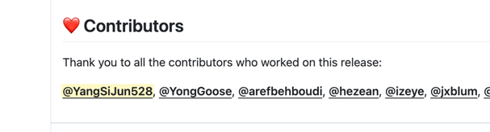
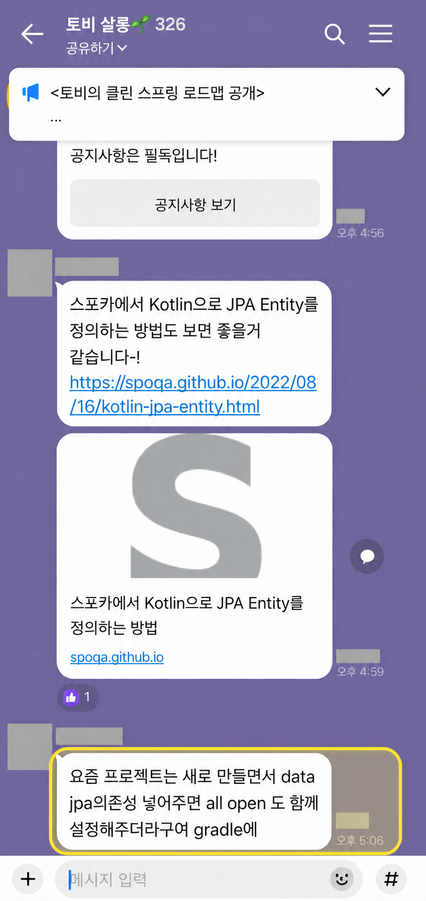
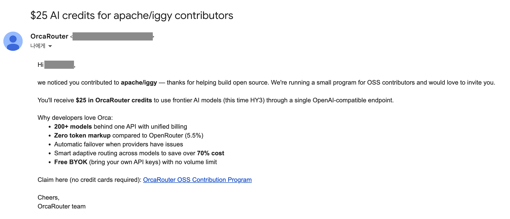
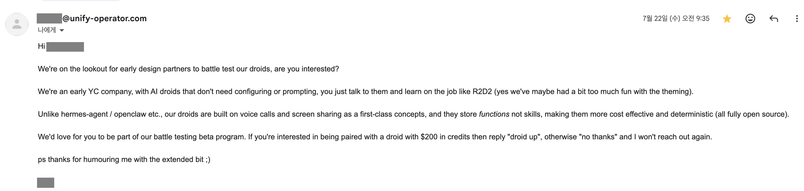
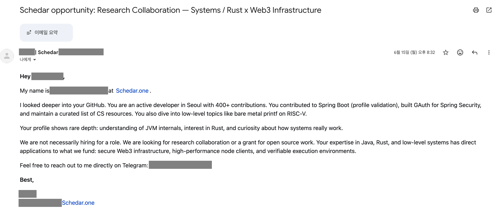

> 아직 작성 중입니다.

# 저자의 글

## 저자 소개

저는 [GitHub에서 YangSiJun528](https://github.com/YangSiJun528)로 활동하고 있고, 취미로 가끔 OSS에 참여합니다.

공개된 활동은 [GitHub에서 작성한 Pull Request 목록](https://github.com/search?q=author%3AYangSiJun528+is%3Apr&type=pullrequests)에서 볼 수 있습니다.

제가 OSS에 참여하는 이유는 대략 이렇습니다.

1. 다른 사람들이 실제로 사용하는 무언가에 참여했다는 성취감
2. 개발 공부
3. 하다보면 좋은 일이 생기지 않을까?

## OSS에 기여하며 얻은 것

OSS 활동 후기를 찾아보면 눈에 띄는 성과를 낸 사람들의 이야기가 많습니다. 하지만 대체로 적극적으로 참여해 온 사람들의 이야기인 경우가 많습니다.

저처럼 가끔 취미로 참여하는 사람은 어떤 결과가 있었을까요?

### 장점

가장 좋았던 점은 제가 만든 변경이 실제 릴리스에 들어가고 사용되는 모습을 볼 수 있다는 것입니다.

<figure>
  
  <figcaption><a href="https://github.com/spring-projects/spring-boot/releases/tag/v3.5.0-M1">Spring Boot 3.5.0-M1 릴리스</a>의 기여자 목록입니다.</figcaption>
</figure>

제가 따로 알리지 않았는데도 다른 사람이 제가 기여한 기능을 이야기하는 모습을 본 적도 있습니다.

<figure>
  
  <figcaption>맨 아래 메시지는 제가 추가한 기능에 관한 이야기입니다. 작업 내용은 <a href="https://github.com/spring-io/initializr/pull/1576">Spring Initializr PR #1576</a>에서 볼 수 있습니다. 참여자의 이름과 프로필 사진은 가렸습니다.</figcaption>
</figure>

여러 프로젝트에 기여하다 보니 기여 이력을 보고 연락이 오기도 했습니다. 제 경우 아직 실제 기회로 이어진 적은 없지만, 누군가에게는 협업이나 다른 기회의 계기가 될 수도 있습니다.

<figure>
  
  <figcaption>OSS 기여자를 대상으로 보낸 서비스 크레딧 제공 메일입니다.</figcaption>
</figure>

<figure>
  
  <figcaption>공개된 개발 활동을 보고 보내온 베타 프로그램 참여 제안입니다.</figcaption>
</figure>

### 단점

가장 큰 단점은 시간이 많이 든다는 것입니다. 들인 시간만큼 확실한 보상이 돌아오는 것도 아닙니다.

공개 활동이 늘면서 원치 않는 홍보나 스팸성 연락이 오기도 했습니다.

<figure>
  
  <figcaption><a href="https://www.linkedin.com/posts/homin-lee-71311838_designing-incentives-in-decentralized-systems-activity-7473485116229726208-pADD">LinkedIn 게시물</a>에서도 다뤄지는 스팸 메일입니다.</figcaption>
</figure>

## 이 글을 쓴 목적

주변에서 OSS 이야기를 하다 보면 관심은 있지만 어디서부터 시작해야 할지 모르겠다는 사람을 자주 만납니다.

후기만 읽어서는 모든 것을 알기 어렵고, 처음 시작할 때는 이미 해 본 사람에게 물어보는 게 제일 빠릅니다.

그래서 비정기적으로 모임을 열고 있습니다. 이 글은 모임에서 함께 볼 참고 자료로 만들었지만, 모임에 참여하지 않아도 볼 수 있도록 공개합니다.
