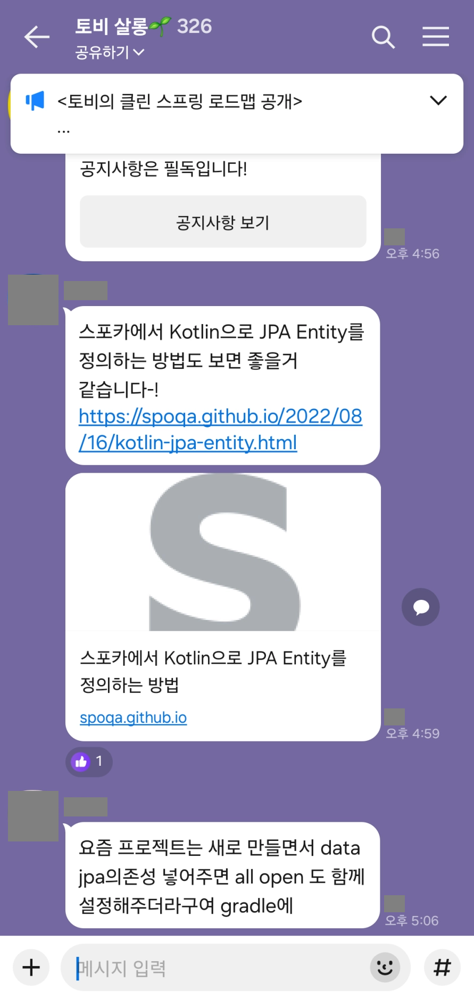
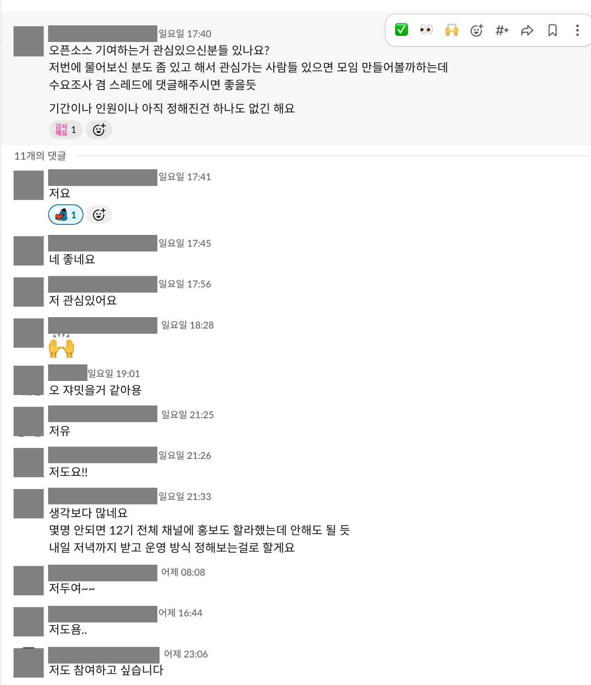

> 아직 작성 중입니다.

# 저자의 글

## 저자 소개

저는 [GitHub에서 YangSiJun528](https://github.com/YangSiJun528)로 활동하고 있고, 그냥 취미로 가끔 OSS에 참여하고 있는 사람입니다.

공개된 활동은 [GitHub에서 작성한 Pull Request 목록](https://github.com/search?q=author%3AYangSiJun528+is%3Apr&type=pullrequests)에서 볼 수 있습니다.

아직까지는 다음 이유로 개발을 하고 있습니다.

1. 남들이 사용하는 무언가에 참여했다는 부분에서 오는 자아 충족과 성취감
2. 개발 공부
3. 뭐라도 하면 좋은 일이 생기지 않을까?

## OSS에 기여하며 얻은 것

생각보다 많으 사람들이 오픈소스 참여를 하고, 글을 보다보면 좋은 사례를 많이 보고 기대하곤 합니다.

다만 이런 사람들은 되게 활동을 적극적으로 하는 사람들이고, 저처럼 취미로 하는 경우에 어떤 결과물을 받을 수 있을까요? 제 경험을 좀 소개해볼까 합니다.

### 장점

개인적으로 좋았던 점은 제가 만든 변경이 실제 릴리스에 들어가고 사용되는 모습을 볼 수 있다는 것입니다.
제가 참여한 변경이 [Spring Boot 3.5.0-M1 릴리스](https://github.com/spring-projects/spring-boot/releases/tag/v3.5.0-M1)에 포함된 적도 있습니다.

다른 사람들이 제가 기여한 기능에 대해서 이야기하는 모습을 본 적이 있기도 하고요.

<figure>
  
  <figcaption>제가 기여한 기능과 관련된 대화입니다. 참여자의 이름과 프로필 사진은 가렸습니다.</figcaption>
</figure>

최근들어 기여를 이곳저곳에 하다 보니 메일이 오기도 하는데, 저는 아직 없지만 좋은 기회로 이어질 수 있는 계기가 될 수도 있습니다.

<figure>
  
  <figcaption>OSS 기여 이력을 언급한 크레딧 홍보 메일입니다. 개인 정보는 가렸습니다.</figcaption>
</figure>

<figure>
  
  <figcaption>공개 활동을 계기로 받은 베타 프로그램 홍보 메일입니다. 개인 정보는 가렸습니다.</figcaption>
</figure>

### 단점

단점은 시간이 많이 든다는 것입니다. 들인 시간만큼 확실한 보상이 돌아오는 것도 아니고, 좋은 메일만큼 공개 활동이 늘면서 스팸 메일이 오기도 했습니다.

아래 메일은 이런 연락의 사례로 소개하는 것이며, 해당 서비스나 제안을 추천한다는 의미는 아닙니다.

<figure>
  
  <figcaption>공개된 기여 이력을 보고 전달된 연구 협업 제안입니다. 개인 이름과 연락처는 가렸습니다.</figcaption>
</figure>

비슷한 사례와 관련해서는 이 [LinkedIn 게시물](https://www.linkedin.com/posts/homin-lee-71311838_designing-incentives-in-decentralized-systems-activity-7473485116229726208-pADD)도 참고할 수 있습니다.

## 이 글을 쓴 목적

주변에 OSS에 대한 이야기를 하다보면 관심은 있지만 어디서 시작해야 할지 모르겠다는 사람들을 많이 접합니다.  

<figure>
  
  <figcaption>OSS 기여 모임을 제안한 뒤 받은 반응입니다. 참여자의 이름과 프로필 사진은 가렸습니다.</figcaption>
</figure>

글로 쓰여진 후기나 다만 글로는 모든것을 알 수는 없습니다. 기여 모임이 활동이 주가 되지만 정리된 형태의 참고자료를 제공하기 위한 목적입니다.
