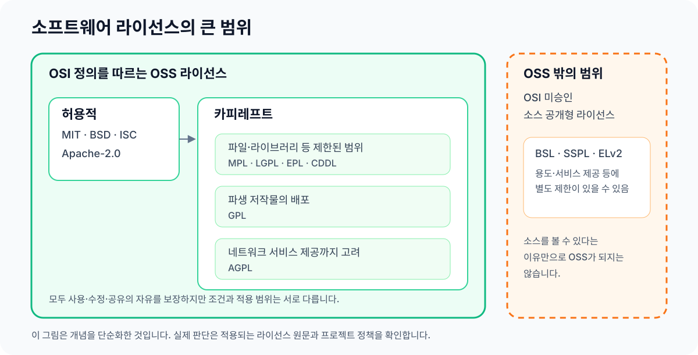

> 아직 작성 중입니다.

# 라이선스

## 라이선스가 하는 일

코드는 일반적으로 작성되는 순간 저작권의 보호를 받습니다. OSS 라이선스는 저작권을 없애는 것이 아니라 다른 사람이 코드를 사용하고 수정하고 배포할 수 있는 조건을 미리 정합니다. 공개 저장소에 `LICENSE`가 없다면 코드를 볼 수 있고 포크할 수 있다는 사실만으로 다른 용도의 사용 권한까지 생기지는 않습니다.

<figure>
  
  <figcaption>자주 접하는 소프트웨어 라이선스의 큰 범위입니다. 같은 계열 안에서도 실제 조건은 서로 다릅니다.</figcaption>
</figure>

## 자주 접하는 OSS 라이선스

| 범위 | 대표적인 라이선스 | 대략적인 특징 |
| --- | --- | --- |
| 허용적 라이선스 | MIT, BSD-2-Clause, BSD-3-Clause, ISC, Zlib | 저작권·라이선스 고지 등 비교적 적은 조건으로 재사용과 재배포를 허용합니다. |
| 특허 조항을 명시한 허용적 라이선스 | Apache-2.0 | 허용적 조건에 기여자의 명시적인 특허권 허여와 관련 조항이 더해집니다. |
| 적용 범위가 제한된 카피레프트 | LGPL-2.1/3.0, MPL-2.0, EPL-2.0, CDDL-1.0 | 라이브러리, 파일 또는 해당 라이선스가 정의한 코드 범위를 중심으로 소스 공개 조건이 적용됩니다. 범위는 라이선스마다 다릅니다. |
| 강한 카피레프트 | GPL-2.0/3.0 | 파생 저작물을 배포할 때 같은 라이선스와 소스 제공을 요구할 수 있습니다. |
| 네트워크 사용을 다루는 카피레프트 | AGPL-3.0 | 수정한 프로그램을 네트워크 서비스로 제공하는 경우에도 소스 제공 의무가 생길 수 있습니다. |

이 표는 라이선스를 고르는 법률 기준이 아니라 처음 읽을 때의 지도입니다. 버전, 예외 조항, 코드를 결합하는 방식과 배포 여부에 따라 결과가 달라질 수 있으므로 실제 조건은 원문을 확인해야 합니다. 문서·이미지·데이터에는 Creative Commons나 Open Data Commons처럼 소프트웨어와 다른 계열의 라이선스가 쓰이기도 합니다.

## 한 프로젝트에 라이선스가 여러 개 있을 때

저장소에 라이선스 파일이 하나 있다고 해서 모든 파일과 결과물에 그 라이선스 하나만 적용된다고 볼 수는 없습니다.

- **복수 라이선스**: 이용자가 여러 라이선스 중 하나를 선택할 수 있습니다. [Rust][rust-license]의 주요 코드는 `MIT OR Apache-2.0`으로 배포됩니다.
- **동시에 적용되는 라이선스**: 서로 다른 라이선스의 코드를 결합한 결과물에는 여러 조건을 함께 지켜야 할 수 있습니다. SPDX에서는 선택을 `OR`, 동시 적용을 `AND`, 예외를 `WITH`로 표현합니다.
- **파일·모듈별 라이선스**: 소스, 문서, 예제, 이미지, 생성 코드와 외부에서 가져온 코드가 서로 다른 라이선스를 가질 수 있습니다.
- **상용·오픈소스 이중 제공**: 같은 소프트웨어를 상용 라이선스와 OSS 라이선스 중 하나로 제공하기도 합니다. [Qt][qt-licensing]는 상용 라이선스와 LGPL/GPL 선택지를 제공하고, 일부 모듈과 외부 구성요소에는 별도 조건이 적용됩니다.

따라서 루트의 `LICENSE`뿐 아니라 `COPYRIGHT`, `NOTICE`, 개별 파일의 SPDX 표시, 하위 디렉터리의 라이선스, 의존성과 SBOM도 함께 확인합니다. [Qt의 제3자 코드 목록][qt-third-party-licenses]처럼 프로젝트가 구성요소별 조건을 따로 정리해 두기도 합니다.

## 자체 라이선스와 소스 공개형 라이선스

재단이나 기업이 만든 라이선스라고 해서 모두 같은 성격인 것은 아닙니다. Apache-2.0, MPL-2.0, EPL-2.0처럼 특정 단체가 관리하면서 OSI 승인을 받은 OSS 라이선스도 있습니다. 반대로 소스 코드를 공개하더라도 용도나 서비스 제공을 제한하면 OSI의 오픈소스 정의를 충족하지 않을 수 있습니다.

유명한 소스 공개형 라이선스에는 다음과 같은 사례가 있습니다.

- [Business Source License 1.1][mariadb-bsl-11]은 지정된 사용 제한과 변경 날짜를 두고, 변경 날짜가 지나면 미리 정한 OSS 라이선스로 전환됩니다.
- [MongoDB의 SSPL][mongodb-sspl]은 서비스 제공에 별도의 소스 공개 조건을 둡니다. OSI는 [SSPL을 오픈소스 라이선스로 보지 않는다는 입장][osi-sspl-not-open-source]을 밝혔습니다.
- [Elastic License 2.0][elastic-license-2]은 사용·수정·재배포를 허용하지만, 관리형 서비스 제공 등 몇 가지 용도를 제한합니다.

이런 라이선스가 나쁘거나 사용할 수 없다는 뜻은 아닙니다. 다만 이름에 `Source`, `Public`이 들어가거나 소스를 읽을 수 있다는 이유만으로 OSS라고 판단해서는 안 됩니다. 표준 라이선스가 아니거나 자체 조건이 있다면 원문과 [OSI 승인 목록][osi-approved-licenses]을 따로 확인해야 합니다.

## 기여하기 전에 확인할 것

프로젝트에 기여한 코드는 일반적으로 해당 프로젝트가 정한 라이선스 아래 배포됩니다. `CONTRIBUTING`과 라이선스 정책을 읽고, 제출할 권리가 없는 회사 코드나 다른 프로젝트의 코드를 임의로 포함하지 않습니다.

프로젝트에서 CLA(Contributor License Agreement)나 DCO(Developer Certificate of Origin)를 요구할 수도 있습니다. CLA는 프로젝트마다 내용이 다른 별도의 동의서입니다. DCO는 서명 줄을 통해 자신이 해당 기여를 제출할 권리가 있음을 확인하는 방식이며, 저작권을 양도하는 문서는 아닙니다.

이 글은 법률 자문이 아닙니다. 업무 코드, 라이선스가 다른 코드의 결합, 재배포처럼 판단이 중요한 상황은 프로젝트의 공식 안내나 전문가에게 확인해야 합니다.

## 더 보기

- [라이선스가 없는 코드][choosealicense-no-permission]: 공개 저장소에 라이선스가 없을 때의 기본적인 취급
- [OSI 승인 라이선스 목록][osi-approved-licenses]: 특정 라이선스가 OSI 승인을 받은 오픈소스 라이선스인지 확인하는 목록
- [SPDX 라이선스 표현식][spdx-license-expressions]: 여러 라이선스의 선택·동시 적용·예외를 표현하는 표준
- [MPL 2.0 FAQ][mozilla-mpl-faq]: 파일 단위 카피레프트와 배포 조건을 설명하는 공식 자료
- [Developer Certificate of Origin][dco]: 프로젝트에서 DCO 서명을 요구할 때 확인할 원문

{{#include ../_includes/references.md}}
