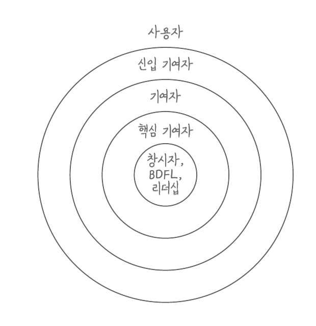

> 아직 작성 중입니다.

# 프로젝트의 구성과 운영 방식

OSS 프로젝트에 참여하려면 일반적인 역할명만 아는 것으로는 부족합니다. 실제 권한, 참여 방법, 운영 주체, 의사결정 방식과 공식 협업 경로를 함께 확인해야 의견을 어디에 제안하고 누구와 논의할지 판단할 수 있습니다.

## 운영 구조

### 다양한 운영 주체

프로젝트는 개인이나 소규모 팀이 관리할 수도 있고, 기업이 개발 인력과 비용을 지원할 수도 있으며, Apache Software Foundation이나 Linux Foundation/CNCF 같은 비영리 생태계 안에서 운영될 수도 있습니다.

코드 저장소의 소유자, 저작권자, 비용을 대는 조직, 기술적 결정을 내리는 사람이 서로 다를 수도 있습니다.

따라서 개인 프로젝트인지 기업이 후원하는 프로젝트인지와 같은 외형만으로 실제 의사결정 구조를 단정할 수 없습니다. 같은 운영 주체 안에서도 프로젝트마다 권한을 나누는 방식과 외부 참여 범위가 다를 수 있습니다.

### 역할명과 실제 권한

OSS 프로젝트에는 다양한 역할의 사람들이 프로젝트를 구성합니다.

- **사용자**: 프로젝트를 사용하고, 문제를 보고하거나 다른 사용자를 돕습니다.
- **신입 기여자(New Contributor)**: 프로젝트의 절차와 문화를 배우며 첫 기여를 준비하거나 진행합니다.
- **기여자(Contributor)**: 코드, 문서, 테스트, 디자인이나 문제 분석을 제안합니다. 한 번만 참여해도 기여자입니다.
- **커미터(Committer)·메인테이너(Maintainer)**: 변경을 피드백하고 병합하고, 저장소·릴리스·이슈를 지속적으로 관리합니다.
- **오너(Owner)·승인자(Approver)·PMC**: 특정 영역이나 프로젝트 전체의 기술적·운영적 결정을 책임집니다.

<figure>
  
  <figcaption>FOSS 커뮤니티의 일반적인 역할을 표현한 양파 모형. VM 브라수어, 『오픈 소스로 미래를 연마하라』, 41쪽에서 인용. 한국어판 © 2019 인사이트.</figcaption>
</figure>

여러 사람이 한 가지의 역할을 맡아 책임을 나눕니다. 경우에 따라 (특히 규모가 작은 경우라면) 한 사람이 여러 역할을 맡을 때도 있습니다.

중심에 가까울수록 활동과 책임이 커지지만 서열이 존재하는 것은 아닙니다. 모든 역할이 있어야만 오픈소스가 존재할 수 있습니다.

구체적인 역할의 이름과 권한은 프로젝트마다 다릅니다. [Kubernetes][kubernetes-roles-and-responsibilities]는 기여자·멤버·리뷰어·승인자를, [Apache Software Foundation][apache-how-it-works]은 커미터와 PMC를 구분합니다.

### 다양한 의사결정 방식

대표적인 방식은 다음과 같습니다. 실제 프로젝트는 여러 방식을 함께 사용할 수 있습니다.

- **개인·창시자 중심**: 한 사람이나 소수의 메인테이너가 최종 결정을 내립니다.
- **메인테이너 합의**: 여러 메인테이너가 리뷰와 공개 토론을 거쳐 방향을 정합니다.
- **위원회 중심**: PMC, Technical Steering Committee 같은 조직이 정해진 투표와 승인 절차를 사용합니다.
- **기업 주도**: 특정 기업의 직원이 핵심 개발과 로드맵을 주도하면서 외부 기여자와 협업합니다.

추가) 개인 리더에게 최종 결정권이 있으면 BDFL(Benevolent Dictator for Life, 자비로운 종신 독재자)이라고 부르기도 합니다.

어느 방식이 항상 더 낫다고 할 수는 없습니다. 기여자에게 중요한 것은 의견을 어디에 제안하고 누가 최종 결정을 내리는지 알 수 있는가입니다.

## 참여 경로

### 프로젝트 참여 방법

흔히 OSS 기여를 코드나 문서를 작성해 제출하는 일로 생각합니다. 그러나 OSS 프로젝트는 코드 저장소뿐 아니라 프로젝트를 만들고 사용하고 이야기하는 사람들로 이루어집니다.

공동체의 범위는 메인테이너와 기여자에서 끝나지 않습니다. 사용하고, 문제를 알리고, 다른 사용자를 돕고, 프로젝트를 소개하는 사람까지 프로젝트 주변에 넓게 연결됩니다.

- **사용하기**: 프로젝트를 실제로 사용하고 주변에 알립니다. 사용하는 것만으로 항상 기여라고 부르지는 않지만, 사용자는 공동체를 구성하는 중요한 역할입니다.
- **문제와 의견 나누기**: 버그를 보고하고, 기능을 제안하고, 질문하거나 다른 사용자를 돕습니다.
- **결과물 만들기**: 코드, 문서, 테스트, 번역과 디자인을 제안합니다. 변경을 제출하는 것은 대표적인 참여 방법이지 유일한 방법은 아닙니다.
- **프로젝트 운영 돕기**: Issue를 정리하고, 변경을 리뷰하고, 행사를 운영하거나 프로젝트를 후원합니다.

이 과정에서 참여자는 프로젝트가 무엇을 중요하게 여기고 어떻게 변화할지에 영향을 줍니다. 정식 멤버가 아니더라도 Issue와 토론에 참여하는 순간부터 프로젝트의 사람들과 관계를 맺고 공동체의 방식 안에서 행동하게 됩니다.

### 협업 서비스와 의사결정 기록

프로젝트에서 코드를 관리하고, 작업을 조율하고, 일상적으로 대화하고, 최종 결정을 기록하는 일은 서로 다른 목적을 가집니다. 작은 프로젝트는 이 모든 일을 한 공간에서 처리할 수 있지만, 규모가 커지면 역할에 따라 여러 협업 경로를 나누기도 합니다.

빠르게 의견을 주고받는 대화와 장기간 남겨야 하는 결정 기록도 성격이 다릅니다. 대화에서 아이디어를 발전시키더라도 최종 결정은 나중에 다른 참여자가 찾아볼 수 있는 공식 기록으로 남길 수 있습니다.

기여자는 단순히 대화가 가능한 곳을 찾는 데서 그치지 않고, 제안·질문·작업 제출·최종 결정에 각각 어떤 절차가 적용되는지를 구분해야 합니다.

| 구분 | 자주 쓰는 방식과 서비스 |
| --- | --- |
| 코드 관리 | GitHub, GitLab, Codeberg, 자체 Git 서버 |
| 기여 제출·검토 | GitHub Pull Request, GitLab Merge Request, Gerrit Change, 메일링 리스트 패치 |
| 작업 관리 | GitHub·GitLab Issue, Jira, Bugzilla, 자체 이슈 추적기 |
| 실시간 소통 | Discord, Slack, Matrix, IRC |
| 논의·결정 기록 | 메일링 리스트, 포럼, GitHub Discussions, Issue, RFC |

예를 들어 코드는 GitHub에서 관리하고, 작업은 Jira에서 추적하며, 질문은 Discord에서 받고, 최종 결정은 Issue나 메일링 리스트에 기록할 수 있습니다.

- [Fastify][fastify-project]는 코드, Issue, Pull Request와 리뷰를 GitHub에서 관리하고 Discord를 실시간 대화에 사용합니다.
- [Apache Polaris][apache-polaris-community]는 개발은 GitHub, 실시간 대화는 Slack, 개발 논의는 `dev@` 메일링 리스트에서 진행합니다. [ASF의 원칙][apache-mailing-list-culture]에 따라 채팅에서 시작한 중요한 기술 논의와 결정도 메일링 리스트에 남깁니다.
- [Linux 커널][linux-kernel-submitting-patches]은 `git`으로 패치를 만들지만, 관련 Maintainer와 메일링 리스트에 패치를 본문으로 보내고 이메일에서 리뷰합니다.

이 가이드의 실습 과정은 처음 접하기 쉽고 많은 프로젝트가 사용하는 GitHub의 Issue와 Pull Request만을 다룹니다.

## 참고 자료

- [오픈소스 프로젝트의 해부학][open-source-guide-project-anatomy]: 일반적인 역할, 프로젝트 구조와 참여 방법
- [오픈소스에 기여하는 방법][open-source-guide]: 일반적인 프로젝트 구조와 의사소통 방식
- [Producing Open Source Software][producing-open-source-software]: 프로젝트 운영과 커뮤니케이션을 깊게 다루는 무료 영문 도서
- 『오픈 소스로 미래를 연마하라』(VM 브라수어), 3장과 6장: 프로젝트 공동체의 역할과 코드 이외의 기여

{{#include ../_includes/references.md}}

[apache-mailing-list-culture]: https://community.apache.org/contributors/mailing-lists.html
[apache-polaris-community]: https://polaris.apache.org/community/
[fastify-project]: https://github.com/fastify/fastify
[kubernetes-roles-and-responsibilities]: https://kubernetes.io/docs/contribute/participate/roles-and-responsibilities/
[linux-kernel-submitting-patches]: https://www.kernel.org/doc/html/latest/process/submitting-patches.html
