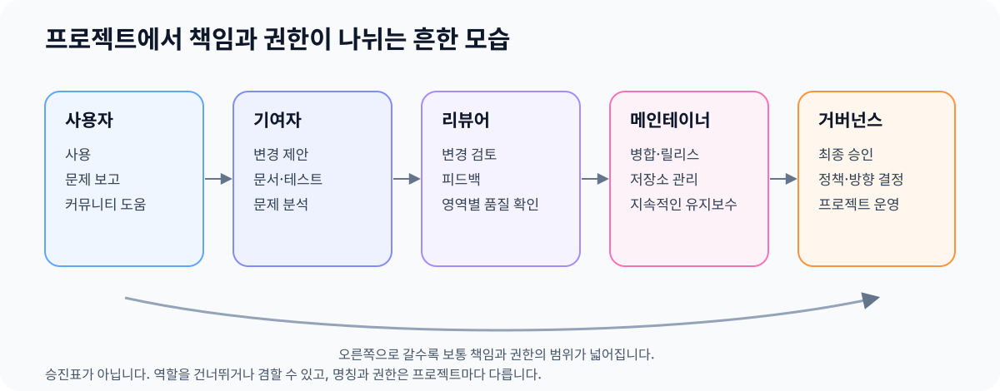

> 아직 작성 중입니다.

# 프로젝트를 구성하는 사람과 조직

## 역할명보다 실제 권한을 확인한다

OSS 프로젝트에는 코드를 쓰는 사람만 있는 것이 아닙니다. 흔히 다음과 같은 역할이 함께 프로젝트를 만듭니다.

- **사용자**: 프로젝트를 사용하고, 문제를 보고하거나 다른 사용자를 돕습니다.
- **기여자(Contributor)**: 코드, 문서, 테스트, 디자인이나 문제 분석을 제안합니다. 한 번만 참여해도 기여자입니다.
- **리뷰어(Reviewer)**: 제안된 변경의 정확성, 범위와 품질을 검토하고 피드백합니다.
- **커미터(Committer)·메인테이너(Maintainer)**: 변경을 병합하고, 저장소·릴리스·이슈를 지속적으로 관리합니다.
- **오너(Owner)·승인자(Approver)·PMC**: 특정 영역이나 프로젝트 전체의 기술적·운영적 결정을 책임집니다.

<figure>
  
  <figcaption>책임과 권한이 넓어지는 흔한 흐름입니다. 역할의 가치나 중요도를 나타내는 서열은 아닙니다.</figcaption>
</figure>

사용자는 프로젝트가 존재하는 이유이자 문제와 요구사항을 가장 먼저 발견하는 사람일 수 있습니다. 따라서 그림의 왼쪽 역할이 오른쪽 역할보다 덜 중요하다는 뜻은 아닙니다. 모든 사람이 다음 역할로 이동해야 하는 것도 아니며, 원하는 범위에서만 참여할 수 있습니다.

작은 프로젝트에서는 한 사람이 사용자 지원, 변경 검토, 릴리스와 최종 결정을 모두 맡기도 합니다. 큰 프로젝트에서는 같은 책임을 여러 팀과 위원회로 나누기도 합니다. 한 사람이 여러 역할을 겸할 수도 있으므로 직함보다 실제로 무엇을 할 권한과 책임이 있는지를 확인해야 합니다.

`member`, `committer`, `owner`, `approver`, `PMC` 같은 이름은 프로젝트마다 뜻이 다릅니다. 어떤 프로젝트에서는 저장소 쓰기 권한을 뜻하고, 다른 프로젝트에서는 투표권이나 릴리스 승인 권한까지 포함합니다. GitHub 조직에 속해 있다는 사실만으로 프로젝트의 모든 결정을 내릴 수 있는 것도 아닙니다.

예를 들어 [Kubernetes][kubernetes-roles-and-responsibilities]는 기여자, 멤버, 리뷰어, 승인자의 역할과 권한을 나눕니다. [Apache Software Foundation][apache-how-it-works]의 프로젝트에서는 커미터와 PMC가 구분되며, PMC가 릴리스와 프로젝트 운영을 책임집니다. 이런 역할은 일반적인 승진 단계라기보다 해당 공동체가 책임과 권한을 나누는 방식입니다.

## 의사결정 방식도 다르다

대표적인 방식은 다음과 같습니다. 실제 프로젝트는 여러 방식을 함께 사용할 수 있습니다.

- **개인·창시자 중심**: 한 사람이나 소수의 메인테이너가 최종 결정을 내립니다.
- **메인테이너 합의**: 여러 메인테이너가 리뷰와 공개 토론을 거쳐 방향을 정합니다.
- **위원회 중심**: PMC, Technical Steering Committee 같은 조직이 정해진 투표와 승인 절차를 사용합니다.
- **기업 주도**: 특정 기업의 직원이 핵심 개발과 로드맵을 주도하면서 외부 기여자와 협업합니다.

어느 방식이 항상 더 낫다고 할 수는 없습니다. 기여자에게 중요한 것은 의견을 어디에 제안하고 누가 최종 결정을 내리는지 알 수 있는가입니다.

## 운영 주체도 다양하다

프로젝트는 개인이나 소규모 팀이 관리할 수도 있고, 기업이 개발 인력과 비용을 지원할 수도 있으며, Apache Software Foundation이나 Linux Foundation/CNCF 같은 비영리 생태계 안에서 운영될 수도 있습니다. 코드 저장소의 소유자, 저작권자, 비용을 대는 조직, 기술적 결정을 내리는 사람이 서로 다를 수도 있습니다.

따라서 프로젝트의 규모나 유명세만 보고 구조를 추측하지 말고, 거버넌스 문서와 `MAINTAINERS`, `OWNERS`, 최근 릴리스와 의사결정 기록을 확인해야 합니다.

## 더 보기

- [오픈소스 프로젝트의 해부학][open-source-guide-project-anatomy]: 일반적인 역할과 프로젝트 구조

{{#include ../_includes/references.md}}

[kubernetes-roles-and-responsibilities]: https://kubernetes.io/docs/contribute/participate/roles-and-responsibilities/
[open-source-guide-project-anatomy]: https://opensource.guide/ko/how-to-contribute/#오픈소스-프로젝트의-해부학
